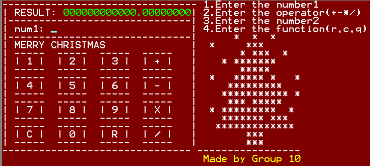
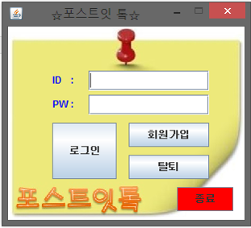
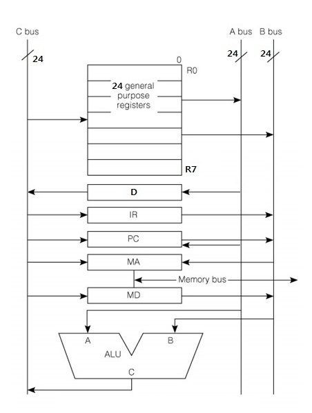
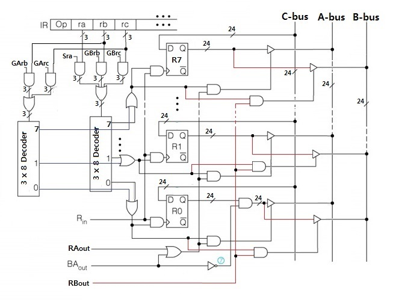
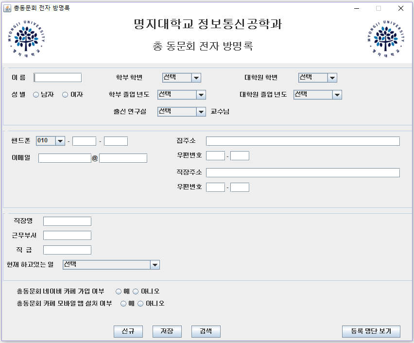
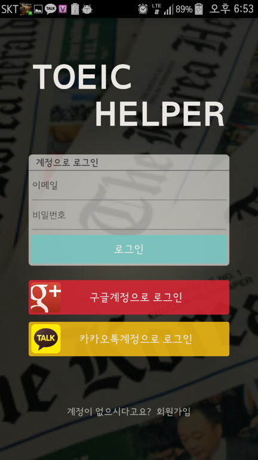
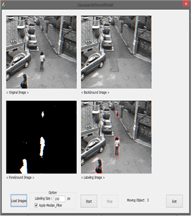
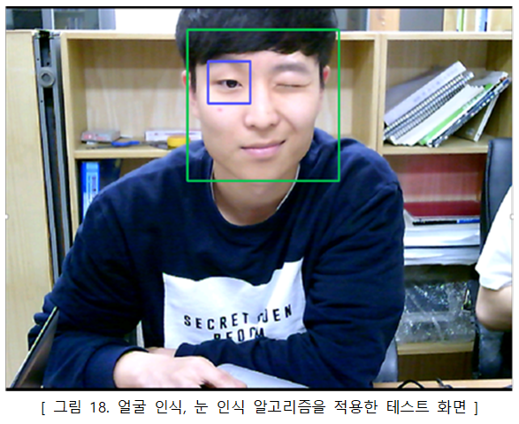
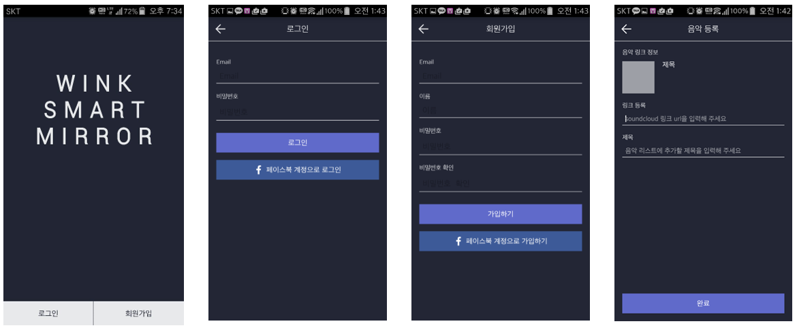
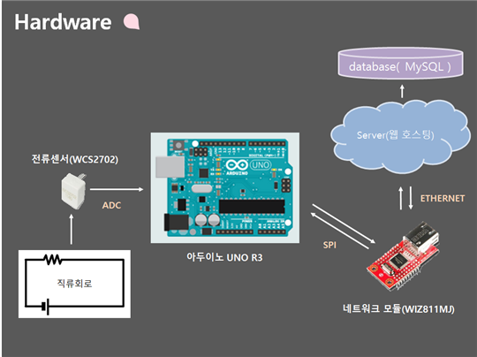

# 방윤환

### 주요활동

#### 교내 **인공지능 연구실** 학부생 소속
- 기간 : 2013.06 ~ 2016.08
- C언어 강의시간 **조교**활동

#### 교내 동아리 활동
- 취업학회 **샘틀터**
	- 기간 : 2013.03 ~ 2015.08
	- 부회장
	- 신입생 대상 **C언어 튜터링** 진행

#### 교외 동아리 활동
- 대학생 연합 IT창업 동아리 **[S.O.P.T](http://sopt.org/wp/)**
	- 기간 : 2014.03 ~ 2014.08
	- 개발 파트 소속
	- 개발 세미나, AppJam 등 Android 앱 개발 관련 활동

#### **[재능넷](http://www.jaenung.net)** 에서 프로그래머로 활동
 - 닉네임 : 방개발
 - 기간 : 2015.06 ~ 2016.12
 - 11건의 Android, Java 애플리케이션 및 대학 과제 등 판매
 - **고객 니즈 파악**에 도움
 - **평점 만점의 판매자** 기록

----------

### 교내 주요 프로젝트

#### **[사칙연산 계산기][1]**
- 수강 과목 : 마이크로 프로세서
-  **EMU8086(MICROPROCESSOR EMULATOR)** 을 사용하여 사칙연산 계산기 개발 
- 기간 : 2012.09 ~ 2012.12
- 총 세 명의 팀원 중 **팀장** 역할
- 특징 : 기존 2^16의 범위의 계산 결과를 넘어 **자릿수의 제한이 없는 실수형 계산기** 구현
- 사용 기술 : `assembly 언어`
- 스크린 샷 :  
  
 

#### **[포스트잇톸][2]**
- 수강 과목 : 객체지향 프로그래밍
- 포스트잇을 붙이고 띄는것에 아이디어를 얻어 Java 애플리케이션으로 구현. 인터넷이 되지 않는 컴퓨터에서의 메신져 프로그램.
- 기간 : 2013.03 ~ 2013.06
- 총 네 명의 팀원 중 **팀장** 역할
- 특징 : Java GUI 구현을 위한 **Swing** 패키지, **Vector** 클래스, **파일 입출력** 
- 사용 기술 : `Java`
- 스크린 샷 :  
  
 

#### **24bit 3-bus CPU 설계**
 - 수강 과목 : 컴퓨터 구조
 - 기존 32bit 1-bus CPU를 바탕으로 **24bit 3-bus CPU의 H/W를 설계**하고, **명령어를 추가**하여 구현
 - 기간 : 2013.05 ~ 2013.06
 - 총 다섯 명의 팀원 중 **팀장** 역할
 - 특징 : **1-bus 구조에서 3-bus 구조** 로 H/W를 설계하면서 명령어 실행과 데이터 처리 효율을 높임
 - 사용 기술 : H/W 및 명령어 설계
 - 스크린 샷 :  
 
 

#### **[학과 총 동문회 전자 방명록][3]**
 - 학과 총 동문회 전자 방명록을 Java 애플리케이션으로 구현하여 정보를 저장하는 프로그램
 - 기간 : 2014.05 ~ 2014.05
 - 특징 : Java GUI 구현을 위한 **Swing** 패키지, **mdb**파일과 연동하기 위해 **JDBC-ODBC** 패키지 사용
 - 사용 기술 : `Java`, `mdb(Microsoft Office Access 데이터베이스)`
  - 스크린 샷 :  

 

#### **[ToeicHelper][4]**
 - 수강 과목 : 산학협력1
 - Toeic 공부에 도움을 주는 Android 애플리케이션.
 - 기간 : 2015.03 ~ 2015.06
 - 특징 : 개인 정보를 위한 **회원제 서비스**, **[ColorDict](https://play.google.com/store/apps/details?id=com.socialnmobile.colordict&hl=ko)** 전자사전 연동하여 개인 단어장 등록, 사용자 등록단어 순위 보기 기능
 - 사용 기술 : `Android Java`, `php`, `MySQL`
 - 스크린 샷 :  

 

#### **[CCTV 영상의 전경과 배경을 분리하는 프로그램(졸업작품)][5]**
 - 수강 과목 : 캡스톤 디자인1
 - 변화에 적응 가능한 **가우시안 혼합 모델(Gaussian Mixture Models)** 을 이용하여 전경(움직이는 객체)과 배경을 분리하는 프로그램
 - 기간 : 2015.03 ~ 2015.06
 - 특징 : GUI를 위해 **MFC** 사용,  전경과 배경 분리를 위한 **[참고 논문](http://www.cse.psu.edu/~rtc12/CSE586Spring2010/papers/emBGsubtractAboutSandG.pdf)**, 
 노이즈 제거를 위해 **Median filter**, 객체 파악을 위한 **Labeling** 적용
 - 사용 기술 : `C++`, `MFC`, `영상처리(no openCV)`
 - 스크린 샷 :  

 

#### **[스마트 거울(졸업작품)][6]**
 - 수강 과목 : 캡스톤 디자인2
 - 거울을 보며 **다양한 정보**를 얻고 노래를 들을 수 있는 스마트 거울을 구현.  
   또한 **안면 인식**과 **음성 인식**으로 기능을 제어할 수 있도록 구현.
 - 기간 : 2016.03 ~ 2016.06
 - 특징 : **[ODROID-C2](https://www.hardkernel.com/main/products/prdt_info.php?g_code=G145457216438)**, 원웨이 미러, 모니터, 웹캠, 마이크를 사용하여 스마트거울 본체를 구현하였으며 사용자 개인정보를 등록하기 위해 **서버**와 **Android 애플리케이션** 개발
 - 사용 기술 : `Android Java`, `MySQL`, `PHP`, `Android openCV`
 - **[시연 영상](https://www.youtube.com/watch?v=P2LmrTozXKo&t=0s&list=PLeeQUsIypApzirs2K54nDy5Q4RPufhjTp&index=2)**
 - 스크린 샷 :  
 
 

### 교외 주요 프로젝트

#### 한이음 공모대전 참가
 - **[[한이음지정공모-LG CNS]에너지 절감 공모전 대비][7]**
	- **에너지 빈곤층**의 자각률을 상승 시키기 위해, 스마트폰으로 **실시간 전기 사용량**을 확인할 수 있도록 도와주는 모바일 애플리케이션 개발. 애플리케이션을 통해 구체적이며 체계적인 전기 사용 계획을 세울 수 있도록 도와준다.
	- 기간 : 2014.05 ~ 2014.12
	- 총 네 명 중 **팀원** 역할
	- Arduino, Android App, Server 개발 총괄
	- 사용한 기술
		- H/W : `Arduino UNO R3`, `전류센서`, `이더넷 모듈`
		- S/W : `Android Java`, `MySQL`, `PHP`
	- 스크린 샷 :  

 

  
 - **[스마트폰을 이용한 멀티탭 전원 관리 프로그램 개발][8] ([공모전 전시](http://haniumexpo.kr/intro/?tab=3) 작품 선정)]**
	- 기존 멀티탭의 화재 발생 위험, 수동으로 스위치를 제어해야 하는 불편함,  멀티탭 방치로 인한 에너지 낭비 등의 문제를 해결하기 위해 **멀티탭 전원 관리 시스템** 구축
	- 기간 :  2015.04 ~ 2015.11
	- 총 다섯 명 중 **팀장** 역할
	- Arduino, Android App, Server 개발 총괄
	- 사용한 기술
		- H/W : `Arduino UNO R3`, `릴레이`, `이더넷 모듈`
		- S/W : `Android Java`, `MySQL`, `PHP`

#### 스타트 업

- **[unbox](https://play.google.com/store/apps/details?id=com.unbox.app.unboxbeta)**
	- **아마추어 예술가를 위한 티켓팅 플랫폼 서비스**(웹사이트, Android, iOS App)
	- 기업 : 언박스 주식회사
	- 기간 : 2015.10 ~ 2016.06
	- 성남 산업 진흥 재단에서 주최한 **스마트 창작터에 선발**되어 창업 지원금 혜택
	- 총 다섯 명의 대학생 팀원 중 **개발자** 역할, 두 명의 외주 개발자와 함께 진행
	- **주요 수행 역할** :  
클라우드 서버 Linux Ubuntu OS 기반의 Django, MySQL, Apache 웹 서버 환경 구현.  
**SSL 인증서**를 이용하여 **보안 서버** 구축.  
Android(Java) 애플리케이션 개발.  
팀원(디자이너, 기획자)과 외주 개발자와 **협업**, 작업 스케쥴링 진행.  
Android 애플리케이션에 필요한 **RESTful API** 요청.  
**Google Cloud Messaging** 서비스를 사용하여 푸시 알림 구현.  
**Facebook** 로그인 API 연동.  
**[아임포트](https://www.iamport.kr/) 결제 모듈** 연동.  

	- 사용한 기술 :  
 **Server** : [KT ucloud biz Server](https://ucloudbiz.kt.com/), Linux Ubuntu OS, Django, MySQL, Apache2, SSL 보안서버  
 **Android Java** 주요 오픈 라이브러리 : [okhttp](https://github.com/square/okhttp), [gson](https://github.com/google/gson), [picasso](https://github.com/square/picasso), [butterknife](https://github.com/JakeWharton/butterknife)

	- **사용 툴** : Android Studio, PuTTY, FileZilla, Github(private)

- **[TimeCapsule](https://play.google.com/store/apps/details?id=com.timecapsule.unbox.timecapsuleapp)**
	- **위치기반 디지털 타임캡슐 서비스**(Android, iOS App)
	- 기업 : 언박스 주식회사
	- 기간 : 2017.10 ~ 2018.05
	- **선도 벤처 연계 기술 창업지원 사업에 선발**되어 창업 교육금 및 자본금을 지원 받음.
	- 총 세 명의 팀원 중 **개발자** 역할, 두 명의 **현직 개발자**와 함께 진행
	- **주요 수행 역할** :  
 클라우드 서버 Linux Ubuntu OS 기반의 php, MySQL, Apache 웹 서버 환경 구현.  
 Android(Java) 애플리케이션 개발.  
 팀원(디자이너, 기획자)과 외주 개발자와 협업, 작업 스케쥴링 진행.  
 Android 애플리케이션에 필요한 **RESTful API** 요청.  
 **Firebase Cloud Messaging** 서비스를 사용하여 푸시 알림 구현.  
 **Facebook** 로그인 API 연동.  
 **Google Map API** 연동 및 위치 데이터 활용.  
 **JSON Web Token**을 사용하여 회원 인증 적용.  
 
	- 사용한 기술 :  
 **Server** : [Amazon Web Service](https://aws.amazon.com/ko/), Linux Ubuntu OS, php, MySQL, Apache2  
 **Android Java** 주요 오픈 라이브러리 : [okhttp](https://github.com/square/okhttp), [gson](https://github.com/google/gson), [picasso](https://github.com/square/picasso), [butterknife](https://github.com/JakeWharton/butterknife)

	- **사용 툴** : Android Studio, PuTTY, FileZilla, GitLab, Slack, Zeplin, Postman

#### 인포메이드

- **[쏠쏠한 선택](https://play.google.com/store/apps/details?id=com.ox)**
	- **선택형 리워드 광고 플랫폼 서비스**(Android, iOS App)
	- 기업 : (주) 인포메이드
	- 기간 : 2018.12 ~ 2020.03
	- 총 다섯 명의 팀원 중 **모바일 앱 개발자(팀원)** 역할. 한 명의 백엔드 개발자(팀장)와 협업. 
	- **주요 수행 역할** :  
[React-native](https://facebook.github.io/react-native) 크로스 플랫폼을 사용하여 모바일 앱 개발(Android, iOS).  
팀원(디자이너, 기획자)과 **협업** 및 **서비스 기획**.  
모바일 앱에 필요한 **RESTful API** 요청.  
**Firebase Cloud Messaging** 서비스를 사용하여 푸시 알림 구현.  
**SNS** 로그인 API 연동. 
컨텐츠 제작 및 운영.
버그 수정 및 서비스 유지 보수.

	- **사용한 기술** : React-native, Android(Java), Javascript, [Redux](https://deminoth.github.io/redux), [react-navigation](https://reactnavigation.org)
	- **사용 툴** : Android Studio, Visual Studio Code, Github(private), Zeplin

- **[유캔두](https://play.google.com/store/apps/details?id=com.youcando)**
	- **생활 속 목표달성 동기부여 서비스**(Android, iOS App)
	- 기업 : (주) 인포메이드, (주) 야나두
	- 기간 : 2019.05 ~ 2019.10
	- 총 열 명의 팀원 중 **모바일 앱 개발자(팀원)** 역할. 한 명의 백엔드 개발자(팀장)와 협업. 
	- **주요 수행 역할** :  
[React-native](https://facebook.github.io/react-native) 크로스 플랫폼을 사용하여 모바일 앱 개발(Android, iOS).  
팀원(디자이너, 기획자)과 **협업** 및 **서비스 기획**.  
모바일 앱에 필요한 **RESTful API** 요청.  
**Firebase Cloud Messaging** 서비스를 사용하여 푸시 알림 구현.  
**SNS** 로그인 API 연동.  
**[페이레터](https://www.payletter.com)** 결제 모듈 연동.
버그 수정 및 서비스 유지 보수.

	- **사용한 기술** : React-native, Android(Java), Javascript, [mobx](https://github.com/mobxjs/mobx), [react-navigation](https://reactnavigation.org)
	- **사용 툴** : Android Studio, Visual Studio Code, Github(private), Zeplin

#### 한국 IBM

- **삼성전자 MUSE 시스템 운영 및 개발**
	- **삼성전자 모바일앱 고객 서비스 센터 웹사이트 및 사내 고객 문의 처리 시스템 개발, 운영**
	- 기간 : 2020.04 ~ 2022.06
	- 웹 사이트, 사내 문의 처리 프로그램 서버, 타 서비스 API 연동, Batch 프로그램 개발 및 운영. 
	- **주요 수행 역할** : 총 일곱 명의 팀원 중 **서버 배포 및 개발자(팀원)** 역할.
Spring 프레임워크 서버(고객용, 상담원용 2개) 개발 및 운영.
Red Hat Enterprise Linux OS 환경 JBoss 서버 관리 및 소스 배포.
로그 분석을 통한 시스템 일일점검 및 서버 모니터링 수행.
AWS SES 를 이용한 메일 발송 시스템 구현.  
타 서비스(Samsung Account, Samsung Members..) REST API 및 모바일 앱 연동.  
Spring Batch 개발 및 Crontab 운영.
고객 문의 처리 Client 프로그램(XPLATFORM) 개발 및 운영. 
고객 요청에 따른 MariaDB 데이터 추출.

	- **사용한 기술** : Spring, Java, JSP, Javascript, MyBatis, Spring Batch, MariaDB, XPLATFORM, Red Hat Enterprise Linux, JBoss
	- **사용 툴** : Visual Studio Code, SVN, MySQL Workbench, SCOUTER

- **삼성전자 VERS 시스템 개선 프로젝트**
	- **삼성전자 관련 벤더사 관리 시스템 개선 및 개발**
	- 기간 : 2022.07 ~ 2022.11
	- 삼성전자 사내 벤더관리 시스템 웹사이트 개발. 
	- **주요 수행 역할** : 총 여섯 명의 팀원 중 **개발자(팀원)** 역할.
Spring 프레임워크 기반 서버 개발.
JSP, Javascript, HTML, CSS 를 사용한 웹 화면 구현.
삼성전자 사내 메일 및 결재 시스템 연동.
고객 요청에 따른 OracleDB 데이터 추출.

	- **사용한 기술** : Spring, Java, JSP, Javascript, MyBatis, Spring Batch, Oracle
	- **사용 툴** : Visual Studio Code, Git, DBeaver

#### 개인 프로젝트
 - **[HouseWork(집안일 공유)](https://play.google.com/store/apps/details?id=com.bangcompany.bang.houseworkapp)**
	- 집안일 공유를 위한 **집안일 To-Do List** 애플리케이션 (Android App)
	- 기간 : 2018.06 ~ 2018.08
	- **주요 수행 역할** :  
 클라우드 서버 Linux Ubuntu OS 기반의 php, MySQL, Apache 웹 서버 구현.  
 Android 애플리케이션에 필요한 **RESTful API** 설계 및 구현.  
 **Android(Kotlin)** 애플리케이션 개발.  
 **JSON Web Token**을 사용하여 회원 인증 적용.  
 **Firebase Cloud Messaging** 서비스를 사용하여 푸시 알림 구현.  
 **Android Material Design** 적용.  
 **MVP** 디자인 패턴 기반으로 구현.  
 
	- 사용한 기술 :  
 **Server** : [Google Cloud Platform](https://cloud.google.com/products/compute/?hl=ko), Linux Ubuntu OS, php, MySQL, Apache2  
 **Android Kotlin** 주요 오픈 라이브러리 : [okhttp](https://github.com/square/okhttp), [gson](https://github.com/google/gson), [picasso](https://github.com/square/picasso)

	- **사용 툴** : Android Studio, PuTTY, FileZilla, GitLab, Slack, Postman

----------

### 수상내역
 - 2016년 **평창문화 올림픽 예술 해커톤 최우수상 [(관련기사)](http://www.fnnews.com/news/201607181744010886)**
	- 평창 올림픽에서 추억할 수 있는 디지털 타임캡슐 서비스 개발
	- Android(Java) 애플리케이션 시제품 개발 및 서버 구현

[1]: https://github.com/kebin11042/Calculator-EMU8086-
[2]: https://github.com/kebin11042/Post_it-talk
[3]: https://github.com/kebin11042/ElectronicVisitorsBook
[4]: https://github.com/kebin11042/ToeicHelper
[5]: https://github.com/kebin11042/GaussiansMixtureModel
[6]: https://github.com/kebin11042/SmartMirror
[7]: https://github.com/kebin11042/hanium_2014
[8]: https://github.com/kebin11042/hanium_2015
